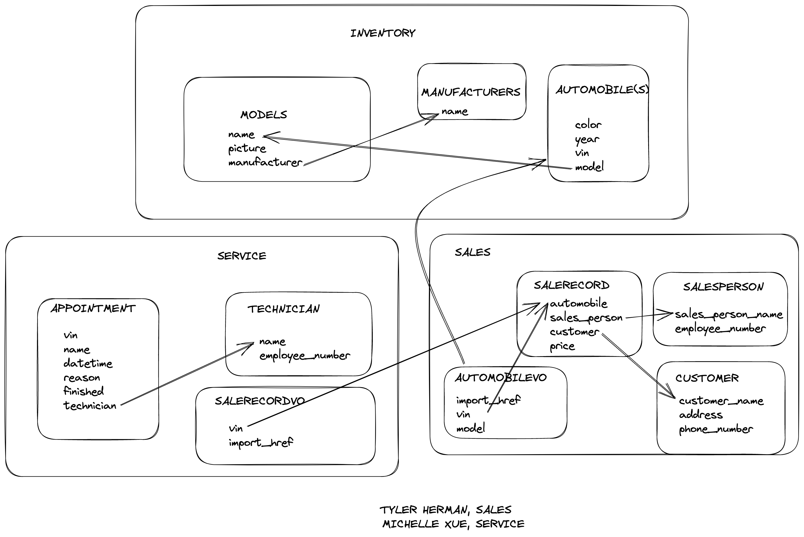

# CarCar

Team:

* Michelle Xue - Service
* Tyler Herman - Sales

## How to Run this Application
### Setup
* Go to [gitlab.com/felipsh/project-beta](https://gitlab.com/felipsh/project-beta)
* Click “Clone” to clone project and copy the https link.
In terminal, run following commands:
* Clone the project folder: `git clone <copy clone link here>`
* Create a volume: `docker volume create beta-data`
* Create containers: `docker-compose build`
* Run containers: `docker-compose up`

In browser visit: [http://localhost:3000/](http://localhost:3000/)

### Entering Data:

Select Manufacturers on the navbar
* Select the Add Manufacturer button
* In the textbox enter “Honda”
* Return to the Manufacturers page via the navbar, you will see “Honda” in the table

Select Vehicle Models on the navbar
* Select the Create a Vehicle Model button
* For Name enter “Civic”
* For Picture copy this link and enter it in the field: https://www.hdcarwallpapers.com/walls/2012_honda_civic-wide.jpg
* For Manufacturer select “Honda”, which you populated in the first step
* Return to Vehicle Models via the navbar, you will see your entries populated

Select Automobiles on the navbar
* Select the Add Automobile button
* For Color enter “Orange"
* For Year 2012
* For VIN enter “KL4CJFSB7FB096115”
* For Model select “Civic”, which you entered before
* Return to Automobiles via the navbar, you will see your data in the table

Select Sales on the Navbar
* Select the Add a Sales Person button
	* Under Name enter “Sally Sales”
	* Under Employee Number enter “11”
	* Return to the Sales page via the navbar
* Select the Add a potential customer button
	* Under Name enter “Chris Customer”
	Under the Address enter “123 Home St, Springfield, MO 85467”
	* Under the Phone Number enter “9045556789”
* Select the Create a sale record button
	* On the Choose an Automobile dropdown, select “KL4CJFSB7FB096115”
	* Under Choose a salesperson select “Sally Sales”
	* Under Choose a customer select “Chris Customer”
	* For the Price enter “1000”
* Return to the Sales page via the navbar, you will see your newly created Sales Record
* Select Sales person history
	* On the choose a sales person dropdown select “Sally Sales”
	* You will see the record of sale you created in the previous step populate the table

Select Service Appointment on the navbar
* Select the Add Technician button
	* For Name enter “Mike Mechanic”
	* For Employee Number enter “1”
	* Return to the Service Appointment Page
* Select the Create Appointment button
	* For Vin enter “KL4CJFSB7FB096115”
	* For Name enter “John Doe”
	* For Date and Time enter “01/01/2024 08:00—
	* For Reason enter “Flat Tire”
	* For Technician select “Mike Mechanic”
	* Return to the Service Appointment page and you will see your appointment logged in the table
* Select Find Appointment
	* In the VIN search bar enter ““KL4CJFSB7FB096115”
	* Once you select Search, you will see your newly made appointment populate below


## Design


## CRUD Routes, API Documentation
### Service Microservice

#### Technician:
Localhost, Port 8080

GET request to /api/technicians/

Returns:
```
{
	"technicians": [
		{
			"name": "Jack",
			"employee_number": "1234567",
			"id": 1
		},
		...
	]
}
```
POST request to /api/technicians/

Request body:
```
{
	"name": "Kim",
	"employee_number": "111111"
}
```
Returns (status code 200):
```
{
	"name": "Kim",
	"employee_number": "111111"
}
```
#### Appointment:
Localhost Port 8080

GET request to /api/appointments/

Returns:
```
{
	"appointments": [
		{
			"id": 1,
			"vin": "1C3CC5FB2AN120100",
			"name": "Noor",
			"datetime": "2023-01-18T18:00:00+00:00",
			"reason": "Oil Change",
			"technician": {
				"name": "Jack",
				"employee_number": "1234567",
				"id": 1
			},
			"finished": false
		},
        ...
	]
}
```

POST request to /api/appointments/

Request body:
```
{
	"vin": "1C3CC5FB2AN120171",
	"name": "Jane",
	"datetime": "2023-01-23T10:00:00+01:00",
	"reason": "Change Oil",
	"technician": 1
}
```
Returns (status code 200):
```
{
	"id": 3,
	"vin": "1C3CC5FB2AN120171",
	"name": "Jane",
	"datetime": "2023-01-23T10:00:00+01:00",
	"reason": "Change Oil",
	"technician": {
		"name": "Jack",
		"employee_number": "1123",
		"id": 1
	},
	"finished": false,
	"vip": false
}
```

DELETE request to /api/appointments/<id>

Delete appointments based on their id numbers

POST request to /api/appointments/<id>

Change appointment's "finished" status from default false to true based on their id numbers

### Sales Microservice

#### Sales Record:
Localhost, Port 8090

GET request to /api/sales/

Returns a list of sales records - one sale record below
```
{
	"salerecord": [
		{
			"sales_person": {
				"sales_person_name": "Veronica Sales",
				"employee_number": 12,
				"id": 1
			},
			"customer": {
				"customer_name": "Xavi Herman",
				"address": "123 Home Dr., Austin, TX 78721",
				"phone_number": "9045557389",
				"id": 1
			},
			"automobile": {
				"import_href": "/api/automobiles/1C3CC5FB2AN120174/",
				"vin": "1C3CC5FB2AN120174",
				"model": "Valiant"
			},
			"price": 12000
		},
		...
	]
}
```

POST request to /api/sales/salerecord/

Request Body:
```
{
	"automobile": "/api/automobiles/5989934TJLSOP/",
	"sales_person": 2,
	"customer": 1,
	"price": 12
}
```
Return Body:
```
{
	"automobile": {
		"import_href": "/api/automobiles/5989934TJLSOP/",
		"vin": "5989934TJLSOP",
		"model": "Valiant"
	},
	"sales_person": {
		"sales_person_name": "Mickey Salesperson",
		"employee_number": 1
	},
	"customer": {
		"customer_name": "Xavi Herman",
		"address": "123 Home Dr., Austin, TX 78721",
		"phone_number": "9045557389"
	},
	"price": 12
}
```

GET request to /api/sales/history/

Returns sales history by selected sales person - one history record below:
```
{
	"sales_history": [
		{
			"sales_person": {
				"sales_person_name": "Veronica Sales",
				"employee_number": 12,
				"id": 1
			},
			"customer": {
				"customer_name": "Xavi Herman",
				"address": "123 Home Dr., Austin, TX 78721",
				"phone_number": "9045557389",
				"id": 1
			},
			"automobile": {
				"import_href": "/api/automobiles/1C3CC5FB2AN120174/",
				"vin": "1C3CC5FB2AN120174",
				"model": "Valiant"
			},
			"price": 12000
		},
		...
	]
}
```

#### Customer:
Localhost, Port 8090

POST request to /api/sales/customer/

Request Body:
```
{
	"customer_name": "Xavi Herman",
	"address": "123 Home Dr., Austin, TX 78721",
	"phone_number": 9045557389
}
```
Return Body:
```
{
	"customer_name": "Xavi Herman",
	"address": "123 Home Dr., Austin, TX 78721",
	"phone_number": 9045557389
}
```

#### SalesPerson:
Localhost, Port 8090

POST request to /api/sales/salesperson/

Request Body:
```
{
	"sales_person_name": "Willy Willy",
	"employee_number": 3
}
```
Return Body:
```
{
	"sales_person_name": "Willy Willy",
	"employee_number": 3
}
```

## Links

* Nav Bar contains list views for manufacturers, models, automobiles, sales records, and service appointments.
* Link to "add a manufacturer" is included on the manufacturer list view.
* Link to "add a model" is included on the model list view.
* Link to "add an automobile" is included on the automobile list view.
* Link to "create a sale record", "add a sales person", "add a potential customer" and "sales record history by sales person" is included on the sales record list view.
* Link to "create a technician", "add an appointment", and "appointment history by VIN" are included on the service appointment list view.

### React Paths
|   |   |
|---|---|
|Main Page|[http://localhost:3000/](http://localhost:3000/)|
|   |   |
|Manufacturers List|[http://localhost:3000/manufacturers/](http://localhost:3000/manufacturers/)|
|Manufacturer Form|[http://localhost:3000/automobiles/new/](http://localhost:3000/automobiles/new/)|
|||
|Models List|[http://localhost:3000/models/](http://localhost:3000/models/)|
|Model Form|[http://localhost:3000/models/new/](http://localhost:3000/models/new/)|
|||
|Automobiles List|[http://localhost:3000/automobiles/](http://localhost:3000/automobiles/)|
|Automobile Form|[http://localhost:3000/automobiles/new/](http://localhost:3000/automobiles/new/)|
|||
|Sales Record List|[http://localhost:3000/sales/](http://localhost:3000/sales/)|
|Sales Person Form|[http://localhost:3000/sales/salesperson/](http://localhost:3000/sales/salesperson/)|
|Customer Form|[http://localhost:3000/sales/customer/](http://localhost:3000/sales/customer/)|
|Sales Record Form|[http://localhost:3000/sales/new/](http://localhost:3000/sales/salerecord/)|
|Search Sales Record History by Sales Person|[http://localhost:3000/sales/history/](http://localhost:3000/sales/history/)|
|||
|Service Appointment List|[http://localhost:3000/appointments/](http://localhost:3000/appointments/)|
|Technician Form|[http://localhost:3000/appointments/technicians/new/](http://localhost:3000/appointments/technicians/new/)|
|Service Appointment Form|[http://localhost:3000/appointments/new/](http://localhost:3000/appointments/new/)|
|Search Service Appointment by VIN|[http://localhost:3000/appointments/history/](http://localhost:3000/appointments/history/)|


## Service microservice

### Technician Model
Technian model has two properties: name and employee_number.

### Appointment Model
Appointment model has the following properties:
* vin: vin of the automobile for this service appointment
* name: name of the automobile's owner
* datetime: date and time of the service appointment
* reason: reason for the service appointment
* finished: a boolean field to determine if the service appointment has been finished. Default value as false.
* vip: a boolean field to determine if the automobile is purchased from the inventory based on the sales record. Default value as false.
* technician: a foreign key to Technician model

### SaleRecordVO Model
* A value object model created for the poller function
* This model has two properties: vin and import_href
* It keeps track of automobiles' vins from sales record

### Integration with the inventory microservice
The poller.py synchronize sales record data with Sales microservice. In views.py, there's a list to keep track of all vins from sales record. When a new Appointment object is created, the "vip" property will change to "true" if the vin is found in the vins list. Then in the service appointment list, there will be an indicator for a VIP appointment.

## Sales microservice

### Purpose

Tracking and updating list of sales, customers, salespersons and sales record history

### Salerecord Model

* Automobile – indicated with VIN of the automobile
* Customer – customer who purchased automobile
* Salesperson – person who sold the automobile
* Price – cost of sale

### SalesPerson Model
* Salesperson name
* Employee Number – number to identify salesperson

### Customer Model
* Customer name
* Customer address
* Customer phone number

### AutomobileVO
* Value Object related to the Automobile model of the inventory
* Gives access to necessary information to track automobiles in the inventory
* Tracks data of the inventory with the poller function.
